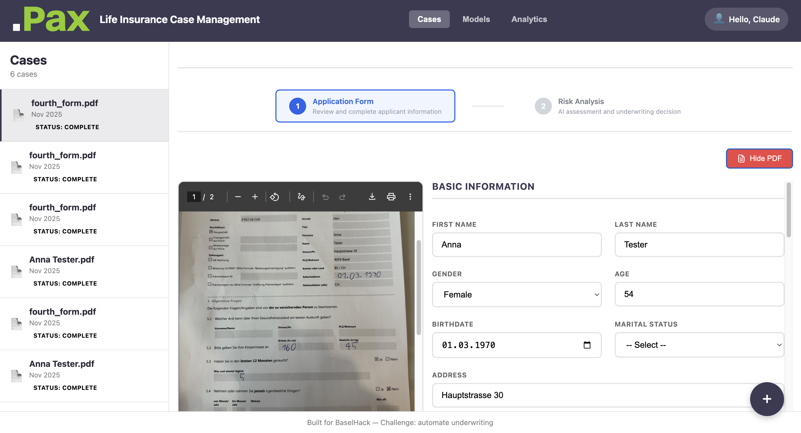
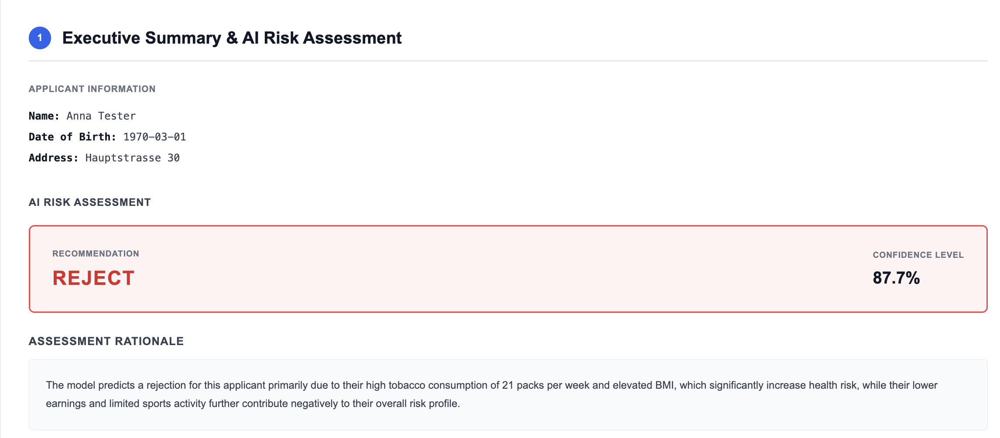
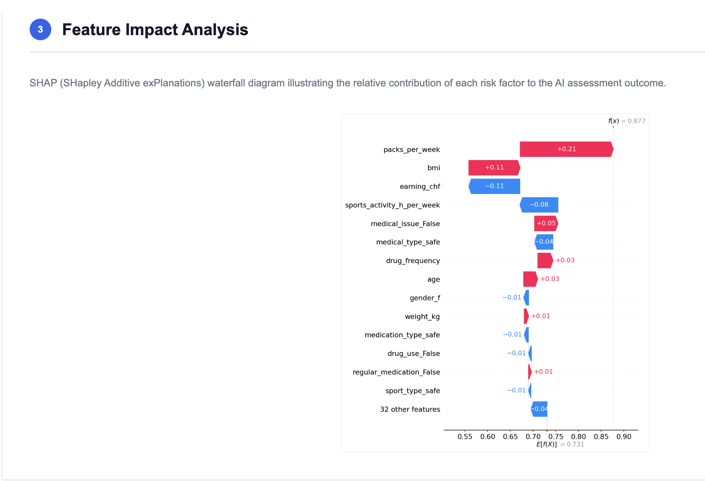
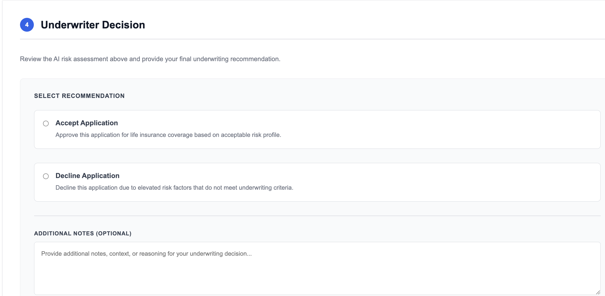

# PAX — Intelligent Insurance Underwriting System

**PAX** is an intelligent document processing and underwriting decision support system that combines OpenAI Vision API for data extraction, XGBoost for risk prediction, and SHAP for explainable AI. It streamlines insurance form processing while providing transparent, data-driven risk assessment with human-in-the-loop decision making.

### DEMO VIDEO : 
[Link to Demo Video](https://drive.google.com/drive/folders/1U1SiXQ0ZcuvW1Xbl8Y1Xf8F5cwJJzBhM?usp=sharing)



---

## 📊 The Decision Pipeline in Action

### Step 1: AI Decision Executive Summary
AI-generated explanation of the risk assessment and model reasoning:



### Step 2: SHAP Explainability Analysis
Feature-by-feature breakdown showing which applicant characteristics drove the prediction:



### Step 3: Underwriter Decision
Human underwriter reviews all information and makes the final binding decision:



---

## 🎯 System Architecture

## 🎯 System Overview

PAX automates the insurance underwriting process through a three-stage pipeline:

1. **Data Extraction** — OpenAI Vision API extracts structured data from PDF insurance forms
2. **Risk Prediction** — XGBoost model predicts risk categories (Safe/Warning/Danger) with full explainability
3. **Decision Support** — AI-generated decision summaries + human underwriter review for final approval

### Key Features

| Feature | Description |
|---------|-------------|
| **📄 Smart Form Processing** | Drag & drop PDF uploads with automatic field extraction |
| **🤖 AI-Powered Risk Assessment** | XGBoost model trained on insurance underwriting patterns |
| **📊 SHAP Explainability** | Understand exactly which factors drove each prediction |
| **💬 Decision Summaries** | GenAI-generated explanations for model predictions |
| **👤 Human-in-the-Loop** | Final underwriter decision with full audit trail |
| **📈 Dependency Analysis** | Interactive plots showing feature relationships |

---

## 🏗️ Architecture

```
┌─────────────────┐
│   Frontend      │ React + Vite
│   (React)       │ Real-time UI
└────────┬────────┘
         │ HTTP/REST
┌────────▼────────┐
│   FastAPI       │ Document Processing
│   Backend       │ Risk Prediction
└────────┬────────┘
         │
    ┌────┴────────────────┐
    │                     │
 ┌──▼──┐            ┌─────▼────┐
 │ PDF │            │ XGBoost  │
 │Data │            │ Model    │
 │ +   │            │+ SHAP    │
 │OpenAI│           │Explainer │
 └──┬──┘            └─────┬────┘
    │                     │
    └─────────┬───────────┘
              │
         ┌────▼────┐
         │  JSON   │
         │ Storage │
         └─────────┘
```

### Tech Stack

**Frontend**
- React 18 with Vite 5
- Interactive visualizations (SHAP plots, dependency charts)
- Lottie animations for processing states

**Backend**
- FastAPI (async Python web framework)
- OpenAI Vision API (document processing)
- XGBoost + SHAP (ML prediction & explainability)
- Matplotlib (visualization generation)

**Data Storage**
- JSON files with document metadata
- Pre-trained ML models (XGBoost + preprocessors)

---

## 📊 The Three-Stage Decision Pipeline

### Stage 1: Data Extraction
OpenAI Vision API automatically extracts 13 structured fields from insurance forms:

- Age, Sex, Height, Weight (BMI calculation)
- Medical Conditions, Smoker Status
- Occupation, Sports Activities
- Address, Annual Income
- Document ID, Filename, Upload Timestamp

### Stage 2: Risk Prediction & SHAP Analysis
XGBoost model predicts risk category with per-feature importance visualization:

- **SHAP Waterfall Plots** — Shows how each feature pushes the prediction up or down
- **Dependency Plots** — Reveals non-linear feature relationships
- **Risk Categories** — Safe | Warning | Danger

### Stage 3: Decision Executive Summary
GenAI generates a one-sentence decision summary explaining the model's reasoning (see workflow images at top)

---

## 🚀 Quick Start

### Prerequisites
- Python 3.12+
- Node.js 18+
- `uv` package manager ([install here](https://docs.astral.sh/uv/getting-started/installation/))
- OpenAI API key ([get here](https://platform.openai.com/api-keys))

### 1. Setup Environment

```bash
# Clone the repository
cd baselhacks_pax

# Create .env file with your OpenAI API key
cat > code/backend/.env << EOF
OPENAI_API_KEY=sk-your-key-here
EOF
```

### 2. Start the Backend

```bash
cd code/backend
uv sync
uv run uvicorn main:app --reload
```

Backend runs on **http://localhost:8000**

API documentation available at http://localhost:8000/docs

### 3. Start the Frontend

```bash
cd code/frontend
npm install
npm run dev
```

Frontend runs on **http://localhost:5173**

### 4. Use the Application

1. Open http://localhost:5173 in your browser
2. **Drag & drop** a PDF insurance form (or click "Browse Files")
3. **Wait for processing** (~2-3 seconds for OpenAI + model prediction)
4. **Review extracted data** and risk assessment
5. **View SHAP analysis** to understand feature impacts
6. **Edit fields** if needed and click "Save"
7. **Make final underwriting decision** with full explanation trail

---

## 🔌 API Endpoints

### Core Endpoints

| Endpoint | Method | Description |
|----------|--------|-------------|
| `/upload` | POST | Upload PDF, extract data, run risk model |
| `/documents` | GET | List all processed documents |
| `/documents/{doc_id}` | GET | Get document details + predictions |
| `/save/{doc_id}` | PUT | Update document data |
| `/pdf/{doc_id}` | GET | Download original PDF |

### Analysis Endpoints

| Endpoint | Description |
|----------|-------------|
| `/waterfalls/{filename}` | SHAP waterfall plot (feature contributions) |
| `/dependency-plots` | Dependency plots (feature relationships) |
| `/models` | Model metadata & performance stats |
| `/analytics` | System-wide analytics & statistics |

---

## 📁 Project Structure

```
baselhacks_pax/
├── assets/                          # Visual assets
│   ├── main.png                     # System overview screenshot
│   ├── shap_analysis.png            # SHAP explainability example
│   ├── decision_exec_summary.png    # AI decision summary
│   ├── underwriter_decision.png     # Final underwriter screen
│   └── bmi_analysis.png             # Feature analysis example
│
├── code/
│   ├── backend/
│   │   ├── main.py                  # FastAPI application
│   │   ├── workflow_agent.py        # OpenAI integration
│   │   ├── requirements.txt         # Python dependencies
│   │   ├── pyproject.toml          # Project metadata
│   │   ├── api/
│   │   │   └── dependency_plots.py  # SHAP visualization API
│   │   ├── data/                    # Processed documents (JSON)
│   │   ├── static/
│   │   │   ├── waterfalls/          # SHAP waterfall plots
│   │   │   ├── dependency_plots/    # Dependency plots
│   │   │   └── model_recommendations_plot/
│   │   └── data/model/              # Pre-trained ML models
│   │       ├── xgboost_model.json
│   │       ├── preprocessor.joblib
│   │       ├── label_encoder.joblib
│   │       ├── shap_background.npy
│   │       └── manifest.json
│   │
│   └── frontend/
│       ├── src/
│       │   ├── App.jsx              # Main React component
│       │   ├── components/
│       │   │   ├── FileUpload.jsx       # Upload interface
│       │   │   ├── Analytics.jsx        # Risk dashboard
│       │   │   ├── DocumentDetail.jsx   # Document viewer
│       │   │   ├── CaseDecision.jsx     # Underwriter decision UI
│       │   │   ├── SuccessConfetti.jsx  # Success animation
│       │   │   ├── AnalysisAnimation.jsx
│       │   │   ├── ExtractionAnimation.jsx
│       │   │   └── Toast.jsx            # Notifications
│       │   ├── index.css
│       │   └── main.jsx
│       ├── public/
│       │   ├── Data Analysis.lottie
│       │   ├── Data Scanning.lottie
│       │   ├── success confetti.lottie
│       │   └── img/
│       ├── package.json
│       ├── vite.config.js
│       └── README.md
│
├── datageneration/                  # ML model training
│   ├── population_generation.py     # Synthetic data generation
│   ├── explore_population.ipynb     # EDA notebook
│   ├── xgboost_shap.ipynb          # Model training & SHAP analysis
│   └── synthetic_life_insurance_10000.json
│
├── documentation/                   # Project documentation
├── licence.txt
└── readme.md
```

---

## 🧠 Machine Learning Pipeline

### Model: XGBoost Risk Classifier

**Training Data:** 10,000 synthetic insurance applicants with labeled risk categories
- Safe (Low risk)
- Warning (Medium risk)
- Danger (High risk)

**Features:** 13 applicant attributes (age, health, occupation, lifestyle)

**Explainability:** SHAP (SHapley Additive exPlanations)
- Per-sample feature contributions
- Waterfall plots showing decision logic
- Dependency plots revealing feature interactions

### SHAP Analysis Details

**What SHAP does:**
- Calculates exact contribution of each feature to the final prediction
- Uses game theory (Shapley values) for fair feature attribution
- Generates visualizations showing which factors pushed risk up/down

**Visualizations:**
1. **Waterfall Plots** — Sequential feature contributions to final decision
2. **Dependency Plots** — Feature value vs SHAP contribution (reveals patterns)
3. **Force Plots** — Interactive feature importance

---

## � How Decision-Making Works

### AI-Powered Decision Summary

Once the XGBoost model makes a prediction, OpenAI generates a human-readable explanation:

```
Inputs to GenAI:
- Model's prediction (Safe/Warning/Danger)
- Top SHAP features (which factors mattered most)
- Feature values from applicant

Output:
One professional sentence explaining the decision
```

Example output:
> "This applicant's combination of pre-existing diabetes and smoking habit with moderate income indicates elevated health risk, resulting in a Warning classification."

### Human-in-the-Loop Review

The underwriter:
1. **Reviews** the applicant data
2. **Examines** the SHAP analysis (feature contributions)
3. **Reads** the AI decision summary
4. **Makes final decision** (Approve/Decline/Further Review)
5. **Adds notes** for compliance & audit trail

---

## � Extracted Data Fields

Each processed insurance application includes:

| Field | Type | Description |
|-------|------|-------------|
| `id` | UUID | Unique document identifier |
| `age` | Integer | Applicant age in years |
| `sex` | String | Male / Female / Other |
| `height_cm` | Float | Height in centimeters (for BMI) |
| `weight_kg` | Float | Weight in kilograms (for BMI) |
| `address` | String | Full residential address |
| `occupation` | String | Job title/profession |
| `sports` | String | Sports/exercise activities |
| `medical_conditions` | String | Medical history & diagnoses |
| `smoker` | String | Yes / No |
| `annual_income` | String | Annual income with currency |
| `filename` | String | Original PDF filename |
| `uploaded_at` | DateTime | Timestamp of upload |

---

## 🔐 Security & Compliance

- **API Keys:** Stored in `.env` file (never commit to git)
- **Audit Trail:** All decisions logged with timestamps
- **Data Privacy:** PDFs and extracted data stored locally
- **No PII Leakage:** GenAI prompts don't include sensitive personal info

---

## 📈 Future Enhancements

- [ ] Multi-language form support
- [ ] Real-time model performance monitoring
- [ ] Batch document processing
- [ ] Advanced analytics dashboard
- [ ] Integration with underwriting workflow systems
- [ ] A/B testing framework for model versions
- [ ] Custom SHAP plot generation per document
- [ ] Document OCR for handwritten forms

---

## 🛠️ Development

### Building Backend

```bash
cd code/backend
uv sync
uv run uvicorn main:app --reload
```

### Building Frontend

```bash
cd code/frontend
npm install
npm run dev
```

### Model Training

Update the ML model with new training data:

```bash
cd datageneration
jupyter notebook xgboost_shap.ipynb
```

---

## 📚 Key Components Explained

### FileUpload Component (Frontend)
- Drag & drop interface with file preview
- Calls `/upload` endpoint
- Displays extraction progress with Lottie animations

### Analytics Component (Frontend)
- Displays risk prediction result
- Shows SHAP waterfall plot
- Shows decision summary
- Links to underwriter decision interface

### Workflow Agent (Backend)
- Orchestrates OpenAI Vision API calls
- Handles response parsing & validation
- Stores extracted data to JSON

### XGBoost Model (Backend)
- Pre-trained on 10,000 synthetic insurance records
- Predicts risk category + probability
- Returns top-5 feature contributions for SHAP

### SHAP Explainer (Backend)
- Calculates Shapley values for each prediction
- Generates waterfall plot images
- Computes dependency plots for feature analysis

---

## 🤝 Contributing

1. Create a feature branch: `git checkout -b feature/your-feature`
2. Commit changes: `git commit -am 'Add new feature'`
3. Push branch: `git push origin feature/your-feature`
4. Create Pull Request

---

## 📄 License

See `licence.txt` for details.

---

## 💬 Support

For issues or questions:
1. Check existing issues on GitHub
2. Review backend README: `code/backend/README.md`
3. Review frontend README: `code/frontend/README.md`

---

**Built for Basel Hacks 2025** 🇨🇭
